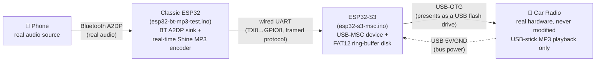
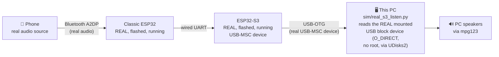
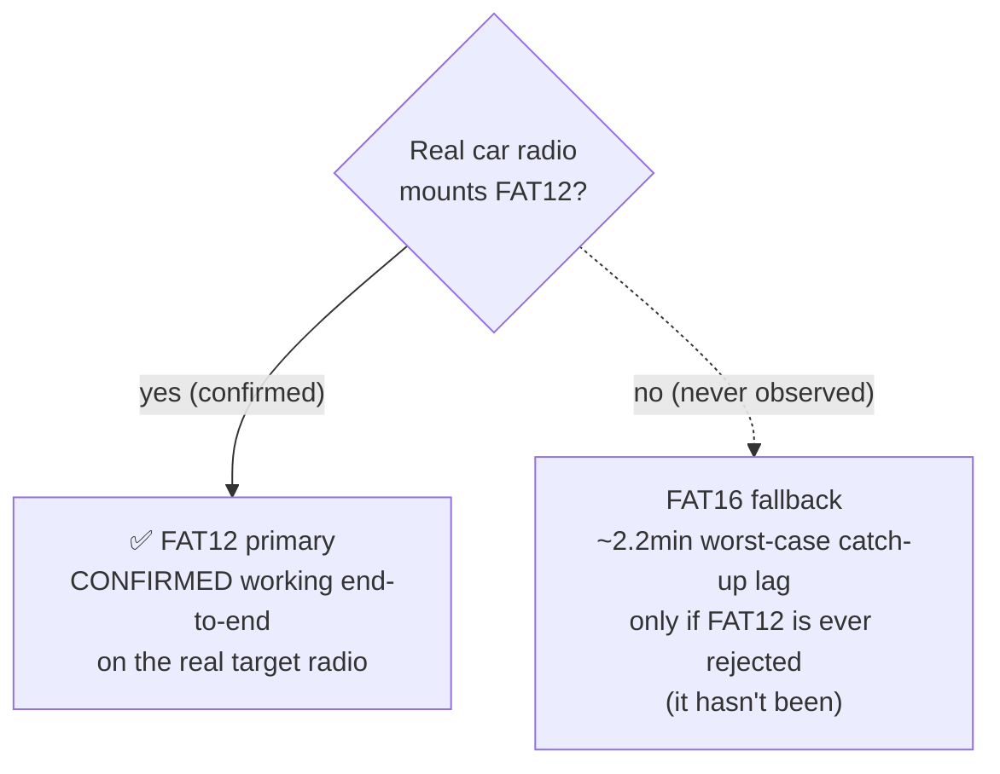

# Architecture

Diagrams of the real hardware design (now confirmed working end-to-end, including on
the actual target car radio), and of the PC-based bench-test tooling used to validate
logic changes before every real-hardware test. GitHub renders the Mermaid blocks below
natively.

## ⚠️ FAQ: "Is the classic↔S3 link WiFi? Do I need a flag to enable the real wired transport?"

**No, and no.** This comes up repeatedly enough to state it as plainly as possible:

- **Both firmware images have exactly ONE data-transport mode each — real wired
  UART, always, unconditionally.** There is no WiFi code path, no flag, no build
  option to switch between "test mode" and "real mode" for this link, because
  there is only one mode.
- Classic ESP32 (`esp32-bt-mp3-test.ino`): sends every byte via plain
  `Serial.write(...)` — that's real hardware UART0 (TX0, GPIO1). Grep the file for
  `WiFi` and the only hit is a comment recalling that WiFi was tried very early in this
  project's history and abandoned (it starved Bluetooth's own init) — there is
  no `#include <WiFi.h>`, no WiFi object, no WiFi code actually running anywhere.
- S3 firmware (`esp32-s3-msc.ino` / the FAT16 fallback): receives via
  `HardwareSerial LinkSerial(1)` on real GPIO pins (`UART_S3_RX_PIN` = GPIO8,
  `UART_S3_TX_PIN` unused) — real UART1, unconditionally.
- The PC-based bench-test tooling (see below) is not a different transport for the
  classic↔S3 link — it's a separate layer entirely, reading the S3's already-real USB
  block device from the PC side, downstream of the real UART link between the two
  boards.

## Real hardware design (confirmed working, including on the actual car radio)

Two ESP32 boards, permanently, by hardware design — not a temporary test
setup. The classic ESP32 does Bluetooth + encoding; the ESP32-S3 does the
USB-MSC device role, since only S2/S3 chips have the USB-OTG peripheral that
requires.

**Data path**: the classic ESP32 receives real PCM over Bluetooth A2DP, encodes
it to MP3 in real time (Shine), and streams the encoded bytes out over a plain
wired UART to the S3. The S3 appends those bytes into a fixed-size ring buffer
and presents itself to the radio as a USB mass-storage device holding one
huge, still-growing MP3 file — the radio just keeps reading further into a
file that looks large but is really a rolling few-minute window of real
content (FAT12 primary; the ring size was tuned up from an original ~25.6s
after real car-radio testing found an audible stutter at the wrap point — see
`fat_disk_shared.h`'s own comments for the full reasoning).

**Power path**: the S3 plugs into the radio's USB port and can draw bus power
from it automatically. The classic ESP32 can either tap the S3's own 5V/GND
pins (one shared supply, the originally-planned single-cable design) or run
from a fully separate power source (e.g. a 12V accessory-outlet USB charger) —
the first successful real-radio test used two separate power sources. Either
way, **the two boards need a direct, shared ground wire between them**
regardless of power source, since the UART link's signal integrity depends on
a clean, short ground reference rather than an indirect one through the
vehicle's chassis wiring. Real current-draw measurement (inrush in
particular, the more likely real risk than steady-state draw on a shared
supply) has not been done with a meter — see `progress/STATUS.md` for the
paper estimate.

## PC-based bench-test tooling

Used throughout development to validate every logic change against the real,
flashed classic ESP32 and (once it existed) the real, flashed S3 — without
needing a physical car radio for every single test cycle.

`real_s3_listen.py` reads the real S3's real USB-MSC block device directly and
paces itself at the real encode bitrate, wrapping at the ring's end — the same
sequential, real-time read pattern a real dumb car-radio reader would use.
Never touches `car_sim.py`/`s3_sim_serial.py`/`fat12_disk.py`. Its one
non-obvious implementation detail: it uses `O_DIRECT` reads, because standard
buffered reads against the raw block device were found to be served from a
stale Linux kernel cache on repeat reads at the same offset — a PC-desktop-OS
artifact with no equivalent on the real car radio's own embedded USB host
stack, but one that made the real, working hardware look broken during bench
testing until it was found and fixed.

An earlier-generation PC-based setup (before the physical S3 board existed)
ran the real firmware's actual disk logic on the PC itself
(`sim/s3_real_firmware_host.cpp`, sharing source with the `.ino` via
`fat_disk_shared.h`) against `car_sim.py`. That tooling still exists and still
works — useful for testing disk-logic changes without needing to reflash real
hardware for every iteration — but is no longer the primary way this project
gets validated, now that real S3 hardware exists and has been confirmed
working end-to-end.

## FAT12 primary vs. FAT16 fallback

FAT12 was chosen as primary specifically because its cluster-count ceiling
(<4085 clusters) lets the declared ring volume stay small, directly bounding
the "how stale can content be" catch-up-lag window. FAT16 needs ≥4085
clusters no matter the cluster size, forcing a much bigger minimum volume and
a correspondingly worse lag bound — it exists purely as insurance against a
real, researched compatibility risk (some cheap embedded USB-MSC host stacks
only fully support FAT16/32), not because it's otherwise preferable. That
risk did not materialize: FAT12 has been confirmed working on the real target
car radio, both as a standalone thumb-drive test and via the full real
end-to-end pipeline.

## What's still genuinely open

- **Real current-draw measurement** — the power architecture above is
  designed and estimated, not measured with a real meter. Matters most if
  both boards ever share one USB-derived supply.
- **The wrap-point audio splice** is mitigated (a much larger ring makes it
  rare) but not structurally eliminated.
- Everything else that used to be listed here as "unverified" — real TinyUSB
  timing under actual USB host read pressure, the final UART pin choice — has
  since been confirmed directly on real hardware, including a real car radio.

See `progress/STATUS.md` for the full, detailed history.
