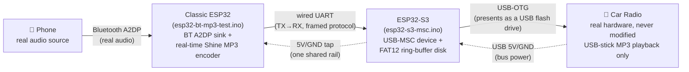
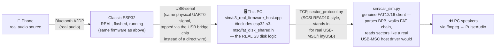
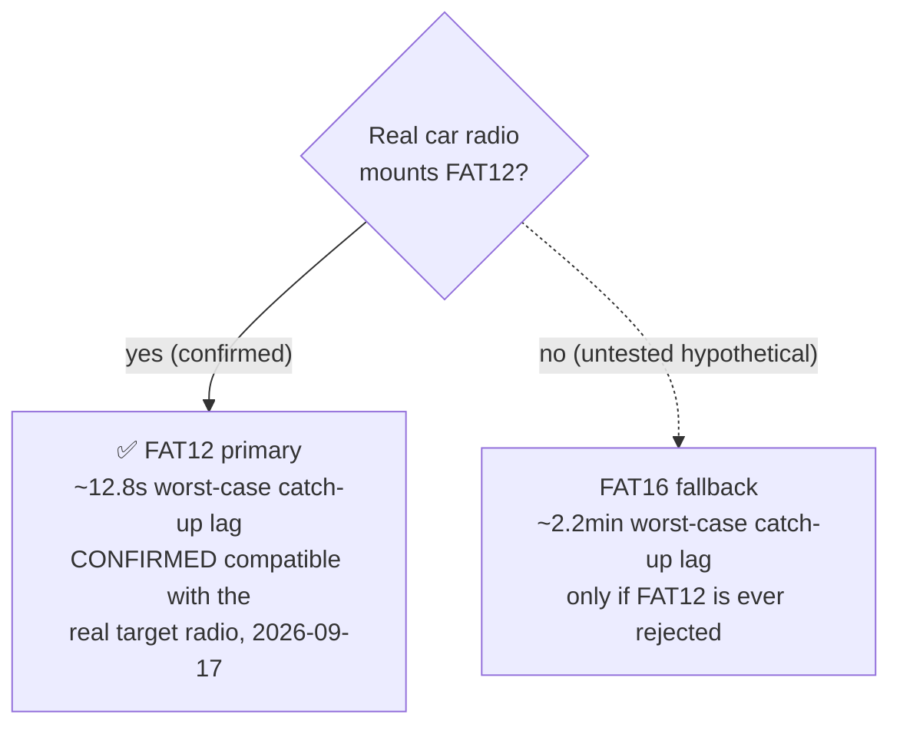

# Architecture

Diagrams of the real end-state hardware/data/power design, and of the current
PC-based test setup used while the physical ESP32-S3 board is still in transit.
GitHub renders the Mermaid blocks below natively.

## Real end-state (what actually ships)

Two ESP32 boards, permanently, by hardware design — not a temporary test
setup. The classic ESP32 does Bluetooth + encoding; the ESP32-S3 does the
USB-MSC device role, since only S2/S3 chips have the USB-OTG peripheral that
requires.

**Data path**: the classic ESP32 receives real PCM over Bluetooth A2DP, encodes
it to MP3 in real time (Shine), and streams the encoded bytes out over a plain
wired UART to the S3. The S3 appends those bytes into a fixed-size ring buffer
and presents itself to the radio as a USB mass-storage device holding one
huge, still-growing MP3 file — the radio just keeps reading further into a
file that looks enormous but is really a rolling ~12.8-second window of real
content (FAT12 primary) or ~2.2 minutes (FAT16 fallback, only if the radio
rejects FAT12).

**Power path** (decided 2026-09-17, not yet built): only ONE physical cable
goes into the car — the S3 plugs into the radio's USB port and draws bus
power from it automatically. The classic ESP32 gets its power by tapping the
S3's own 5V/GND pins (sourced from that same USB VBUS), not a separate
supply. Research-based estimate: ~205-310mA combined sustained draw against
a typical ~500mA-1A radio USB budget — plausible, with the real risk being
power-up inrush tripping a cheap port's polyfuse, not steady-state brownout.
See `CLAUDE.md`'s power-architecture section and `progress/STATUS.md` for the
full numbers and sourcing. Not yet measured on real hardware.

## Current PC-based test setup (while the S3 board is in transit)

The physical S3 board hasn't arrived yet. Rather than a hand-copied Python
simulation, the S3's role is currently played by a PC program that
`#include`s the real firmware's actual disk logic — same source, not a
lookalike.

**Why this is a faithful stand-in, not a simulation of a simulation**: the
disk logic running on the PC (`build_boot_sector`, `build_fat`,
`build_root_dir`, `disk_append`, `disk_read_at`, the ring/backpressure logic)
is the literal same source file the real `.ino` compiles from
(`fat_disk_shared.h`), with only the platform glue (mutexes, serial I/O)
swapped between FreeRTOS/Arduino and POSIX/`std::`. It deliberately does
**not** retry on a straddled read the way the older, now-retired
`s3_sim_serial.py` prototype did — it calls the shared `disk_read_at()`
exactly once per request with zero retry, matching what the real firmware's
non-blocking TinyUSB callback will actually do.

`sim/run_resilient_real_firmware.sh` runs both halves (`s3_real_firmware_host`
+ `car_sim.py`) together with automatic restart-on-crash, mirroring
`run_resilient.sh`'s reasoning but for this newer, higher-fidelity pipeline.

A second pair of these files (`fat16_disk_shared.h`,
`s3_real_firmware_host_fat16.cpp`) exists for the FAT16 fallback, validated
with the same rigor and the same live classic-ESP32 connection.

## FAT12 primary vs. FAT16 fallback

FAT12 was chosen as primary specifically because its cluster-count ceiling
(<4085 clusters) lets the declared ring volume be tiny, directly bounding the
"how stale can content be" catch-up-lag window. FAT16 needs ≥4085 clusters no
matter the cluster size, forcing a much bigger minimum volume and a
correspondingly worse lag bound — it exists purely as insurance against a
real, researched compatibility risk (some cheap embedded USB-MSC host stacks
only fully support FAT16/32), not because it's otherwise preferable.

That compatibility risk is now **resolved**: real physical FAT12 and FAT16
USB thumb drives were prepared and tested directly against Muni's actual car
radio (independent of the S3 board, using only the disk images each firmware
variant would produce) — both now mount and play correctly. See
`progress/STATUS.md`'s "MAJOR: FAT12 confirmed compatible with the real car
radio" entry for the full test, including two real bugs found and fixed along
the way (a `car_sim.py` FAT12/FAT16 entry-parsing bug, and a radio-visible
issue traced to either MP3 metadata or FAT chain length — not conclusively
isolated, but fixed in practice).

## What's still genuinely unverified

Everything above the "current PC-based test setup" diagram that depends on
the physical S3 board or the exact combination of real radio + real S3 can't
be fully closed out from a PC alone:

- **Real TinyUSB/USB-OTG timing** under actual USB host read pressure — the
  PC stand-in is the same logic, but a PC's read/scheduling timing isn't
  identical to TinyUSB's.
- **Power delivery** — the architecture above is designed and estimated, not
  measured. Needs a real current-draw check once the S3 board exists.
- **Final UART pin choice** — currently a placeholder (`UART_S3_RX_PIN`,
  GPIO18) pending the real board's physical wiring.

See `progress/MORNING_RUNBOOK.md` for the ordered checklist to work through
once the S3 board arrives.
