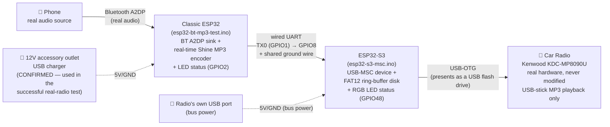
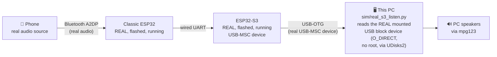
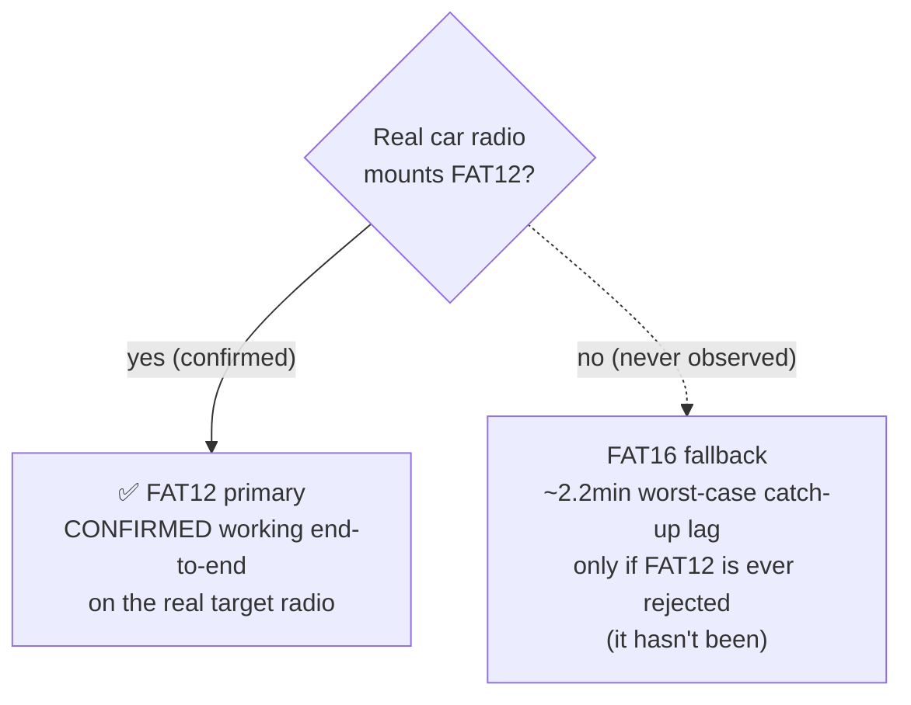

# Architecture

Diagrams of the real hardware design as actually built and confirmed working end-to-end
— including on the real target car radio — and of the PC-based bench-test tooling used
to validate logic changes along the way. GitHub renders the Mermaid blocks below
natively.

## Real hardware design (as actually built and confirmed working)

Two ESP32 boards, permanently, by hardware design — not a temporary test setup. The
classic ESP32 does Bluetooth + encoding; the ESP32-S3 does the USB-MSC device role,
since only S2/S3 chips have the USB-OTG peripheral that requires. No single ESP32 chip
does both halves: the classic chip has Bluetooth Classic (A2DP) but no USB-OTG; the S2/S3
chips have USB-OTG but only BLE, not Bluetooth Classic.

**Data path**: the classic ESP32 receives real PCM over Bluetooth A2DP, encodes it to MP3
in real time (Shine), and streams the encoded bytes out over a plain wired UART to the
S3. The S3 appends those bytes into a fixed-size ring buffer and presents itself to the
radio as a USB mass-storage device holding one huge, still-growing MP3 file — the radio
just keeps reading further into a file that looks large but is really a rolling
few-minute window of real content (FAT12 primary; the ring size was tuned up from an
original ~25.6s after real car-radio testing found an audible stutter at the wrap point —
see `fat_disk_shared.h`'s own comments for the full reasoning).

**Wiring**: classic ESP32's TX0 (GPIO1) → S3's GPIO8, one-way (the S3 never talks back),
plus a direct ground wire between the two boards. That ground wire is required regardless
of how each board is powered — the UART link's signal integrity depends on a clean, short
ground reference, not an indirect one through the vehicle's chassis wiring.

**Power**: the setup actually used in the first successful real-radio test runs the two
boards from **two separate power sources** — the S3 plugged directly into the radio's USB
port (drawing bus power automatically), and the classic ESP32 powered from a separate 12V
accessory-outlet USB charger. This sidesteps a real, unmeasured risk that was flagged
earlier in this project's history: whether a cheap radio's USB port can supply enough
current (inrush at power-up, specifically) for two active ESP32 boards at once. With
separate supplies, the radio's own port only ever has to power one board.

An alternative, single-cable design (S3 draws bus power from the radio, classic ESP32
taps its 5V/GND straight off the S3's own pins) was the original plan — **tried on real
hardware and confirmed NOT viable, root-caused against the official Espressif schematic,
not just abandoned as untested.** The S3's "5V" header pin sits downstream of a Schottky
diode (D7 in the official ESP32-S3-DevKitC-1 schematic, SCH_ESP32-S3-DevKitC-1_V1.1)
between it and the S3's own native USB port — a normal, deliberate part of the board's
design (it OR-gates the board's two USB ports so neither backfeeds the other), but it
means voltage pushed OUT through that pin, while the S3 is powered via its own USB, has
already dropped below 5V before it even leaves the board. Live-tested: classic → S3
power (through the same pin, opposite direction) works cleanly, since that path never
passes through the diode at all; S3 → classic consistently produced a weak/brownout
classic boot (glows on reset, doesn't stay running) regardless of how strong the
upstream charger was — expected, since the bottleneck is a fixed voltage drop, not
available current. A real fix exists (an independent third 5V source Y-split to both
boards' power pins in parallel, bypassing the S3's onboard diode entirely; or physically
bridging D7, at the cost of losing its port-isolation protection) but wasn't pursued —
two separate power sources, already proven working, was preferred instead.

## PC-based bench-test tooling

Used throughout development to validate logic changes against the real, flashed classic
ESP32 and (once it existed) the real, flashed S3 — without needing a physical car radio
for every single test cycle.

`real_s3_listen.py` reads the real S3's real USB-MSC block device directly and paces
itself at the real encode bitrate, wrapping at the ring's end — the same sequential,
real-time read pattern a real dumb car-radio reader would use. Never touches
`car_sim.py`/`s3_sim_serial.py`/`fat12_disk.py`. Its one non-obvious implementation
detail: it uses `O_DIRECT` reads, because standard buffered reads against the raw block
device were found to be served from a stale Linux kernel cache on repeat reads at the
same offset — a PC-desktop-OS artifact with no equivalent on the real car radio's own
embedded USB host stack, but one that made the real, working hardware look broken during
bench testing until it was found and fixed.

An earlier-generation PC-based setup (before the physical S3 board existed) ran the real
firmware's actual disk logic on the PC itself (`sim/s3_real_firmware_host.cpp`, sharing
source with the `.ino` via `fat_disk_shared.h`) against `car_sim.py`. That tooling still
exists and still works — useful for testing disk-logic changes without needing to reflash
real hardware for every iteration — but is no longer the primary way this project gets
validated, now that real S3 hardware exists and has been confirmed working end-to-end.

## FAT12 primary vs. FAT16 fallback

FAT12 was chosen as primary specifically because its cluster-count ceiling (<4085
clusters) lets the declared ring volume stay small, directly bounding the "how stale can
content be" catch-up-lag window. FAT16 needs ≥4085 clusters no matter the cluster size,
forcing a much bigger minimum volume and a correspondingly worse lag bound — it exists
purely as insurance against a real, researched compatibility risk (some cheap embedded
USB-MSC host stacks only fully support FAT16/32), not because it's otherwise preferable.
That risk did not materialize: FAT12 has been confirmed working on the real target car
radio (a Kenwood KDC-MP8090U), both as a standalone thumb-drive test and via the full
real end-to-end pipeline.

## What's still genuinely open

- **The wrap-point audio splice** is mitigated (a much larger ring makes it rare) but not
  structurally eliminated.
- Everything else that used to be listed here as "unverified" — real TinyUSB timing under
  actual USB host read pressure, the final UART pin choice — has since been confirmed
  directly on real hardware, including a real car radio.

See `progress/STATUS.md` for the full, detailed history.
